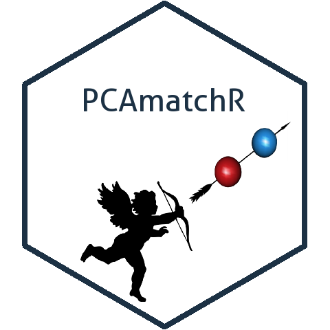

# PCAmatchR 

<!-- badges: start -->

[](https://cran.r-project.org/package=PCAmatchR)
[](https://r-pkg.org/pkg/PCAmatchR)


<!-- badges: end -->

<h2 id="overview">

Overview

</h2>

*PCAmatchR* optimally matches a set of population-based controls to cases. *PCAmatchR* converts user-provided principal components (PC) into a Mahalanobis distance metric for selecting a set of well-matched controls for each case.

*PCAmatchR* takes as input user defined PCs and eigenvalues and directly outputs optimal case and control matches.


<h2 id="important">

Important Note

</h2>

The *optmatch* code is not contained in this package.  In order to use *PCAmatchR*, users must manually install and load the *optmatch* package (>=0.9-1) separately and accept its license.  Manual loading is necessary due to software license issues.  If the *optmatch* package is not loaded, the *PCAmatchR* main function, `match_maker()`, will fail and display an error message.  For more information about the *optmatch* package, please see the reference below.

<h2 id="install">

Installation

</h2>

To install the release version from CRAN:

    install.packages("PCAmatchR")

To install the development version from GitHub:

    devtools::install_github("machiela-lab/PCAmatchR")

<h2 id="available-functions">

Available functions

</h2>

<table>
<colgroup>
<col width="30%" />
<col width="70%" />
</colgroup>
<thead>
<tr class="header">
<th>Function</th>
<th>Description</th>
</tr>
</thead>
<tbody>
<td><code>match_maker</code></td>
<td>Main function. Weighted matching of controls to cases using PCA results.</td>
</tr>
<td><code>plot_maker</code></td>
<td>Easily make a plot of matches from <code>match_maker</code> output.</td>
</tr>
</tbody>
<table>

<h2 id="available-datasets">

Available sample data sets

</h2>

<table>
<colgroup>
<col width="30%" />
<col width="70%" />
</colgroup>
<thead>
<tr class="header">
<th>Data set</th>
<th>Description</th>
</tr>
</thead>
<tbody>
<tr class="odd">
<td><code>PCs_1000G</code></td>
<td>First 20 principal components of 2504 individuals from Phase 3 of 1000 Genomes Project.</td>
</tr>
<tr class="odd">
<td><code>eigenvalues_1000G</code></td>
<td>A sample data set containing the first 20 eigenvalues.</td>
</tr>
<tr class="odd">
<td><code>eigenvalues_all_1000G</code></td>
<td>A sample data set containing all of the eigenvalues.</td>
</tr>
</tbody>
<table>

## Usage
``` r
library(PCAmatchR)
library(optmatch)

##### Input match_maker sample data

 # Create PC data frame
 pcs<- as.data.frame(PCs_1000G[,c(1,5:24)])

 # Create eigenvalues vector
 eigen_vals<- c(eigenvalues_1000G)$eigen_values
 
 # Create full eigenvalues vector
 all_eigen_vals<- c(eigenvalues_all_1000G)$eigen_values

 # Create Covarite data frame
 cov_data<- PCs_1000G[,c(1:4)]

 # Generate a case status variable
 cov_data$case <- ifelse(cov_data$pop=="ESN", c(1), c(0))


###################
# Run match_maker #
###################

# 1 to 1 matching
test <- match_maker(PC = pcs,
                    eigen_value = eigen_vals,
                    data = cov_data,
                    ids = c("sample"),
                    case_control = c("case"),
                    num_controls = 1,
                    eigen_sum = sum(all_eigen_vals))
test$matches
test$weights


# 1 to 2 matching
test <- match_maker(PC = pcs,
                    eigen_value = eigen_vals,
                    data = cov_data,
                    ids = c("sample"),
                    case_control = c("case"),
                    num_controls = 2,
                    eigen_sum = sum(all_eigen_vals))
test$matches
test$weights


# 1 to 1 matching with exact "gender" matching
test <- match_maker(PC = pcs,
                    eigen_value = eigen_vals,
                    data = cov_data,
                    ids = c("sample"),
                    case_control = c("case"),
                    num_controls = 1,
                    eigen_sum = sum(all_eigen_vals),
                    exact_match=c("gender"))
test$matches
test$weights

```

<h2 id="reference">

Reference

</h2>

Hansen BB, Klopfer SO. Optimal full matching and related designs via network flows. Journal of computational and Graphical Statistics. 2006 Sep 1;15(3):609-27.

